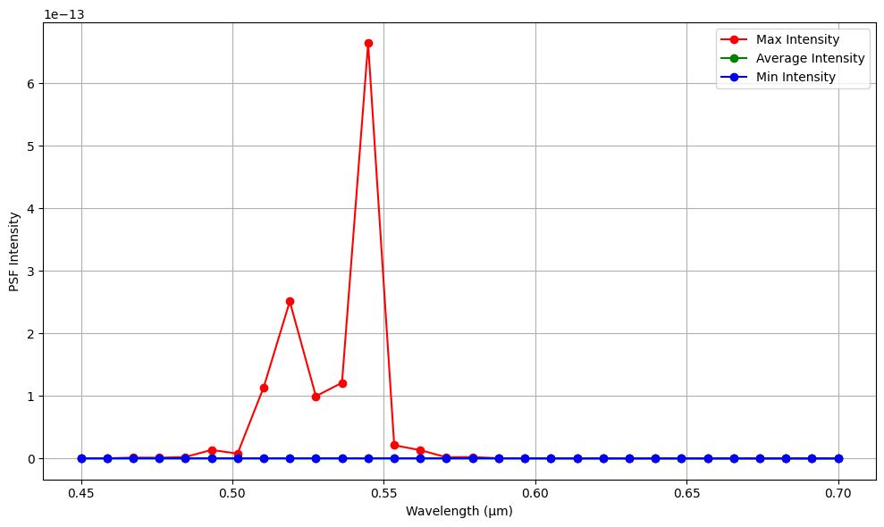
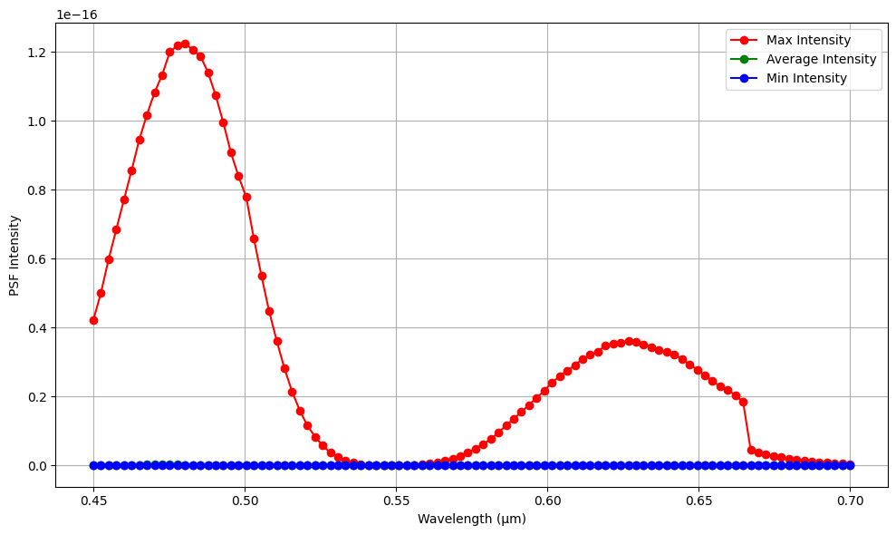

# Image aberration 

The code is at `aberrated_img.py` in this directory.

## Optical System

Spatially filtered PSF.
Paper: https://www.spiedigitallibrary.org/journals/advanced-photonics/volume-6/issue-06/066002/Deep-learning-driven-end-to-end-metalens-imaging/10.1117/1.AP.6.6.066002.full
1. Achromatic doublet(Thorlabs: AC127-019-A) - f = 19 mm (12.7mm diameter)
2. 20µm pinhole
3. Spherical Lens (Thorlabs: LA1461-A - N-BK7 Plano-Convex Lens) - f = 250 mm (25.4 mm diameter) collimated.
4. Phase modulation.. Note that this doesn't represent the phase modulation of the metalens in the paper. But it is impossible to perfectly emulate the metalens's phase profile, because the PSF imaging simulation hypothesize spatially invariant degradation and this wave optics setting may make it hard to train the sub-wavelength characteristics of the metalens.

## Experiments

We conducted the experiments to analyze the influence of the chromatic aberration on the PSF intensity because there is a significant difference among the PSF intensities of the various target wavelength parameters.  

The x-axis of the figures below is the optical system's wavelength parameter for the experiment. Plus, we set the target wavelength as 0.532 (µm). 

### 1. Proper Simulation Field (sufficient pixel_num)
    pixel_size=[0.8, 0.8],
    pixel_num=[2000, 2000],
    target_lamb0=0.532,
    defocus=[29*1e3, 24.5*1e3, 20.5*1e3],
    refractive_index=1,
    paraxial=False,
    focal_lengths=[19*1e3, 19*1e3, 24.5*1e3],
    Ds=[10*1e3, 10*1e3, 10*1e3],
    pinhole_width=0,
    nyquist_spatial_bound=True

    

### 2. Inadequate Simulation Field (insufficient pixel_num)
    pixel_size=[0.5, 0.5],
    pixel_num=[1000, 1000],
    target_lamb0=0.532,
    defocus=[29*1e3, 24.5*1e3, 20.5*1e3],
    refractive_index=1,
    paraxial=False,
    focal_lengths=[19*1e3, 250*1e3, 24.5*1e3],
    Ds=[12.7*1e3, 25.4*1e3, 10*1e3],
    pinhole_width=20,
    nyquist_spatial_bound=True

    

