# Diffraction
The code is at `diffraction.py` in this directory.

## Goal
Verify whether the framework can accurately model the diffraction phenomena for various parameters (e.g. wavelengths, pupil widths, and pupil types.)  

## Opical System
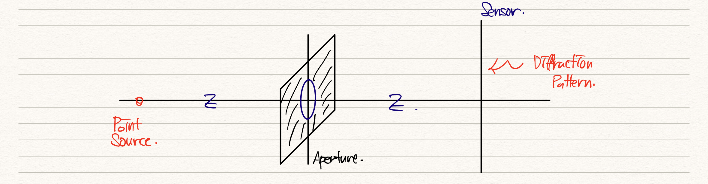  
This system utilizes the planewave.  

The default configuration of the optical system follows as :

```python
Prop = Diffraction(
    pixel_size=[0.6, 0.6],
    pixel_num=[1000, 1000],
    lamb0=[0.4, 0.55, 0.7],
    refractive_index=1,
    paraxial=False,
    focal_length=10*1e3,
    NA=0.3,
    pupil_type=pupil_type,
    pupil_width=100,
    nyquist_spatial_bound=False
) # This system utilizes the planewave.
```

## Check the intermediate outputs of the code.
1. Field before applying the pupil function of the given aperture.
2. Field after applying the pupil function
3. Field after applying ASM (distance z = 10µm)
4. Detected intensity on the sensor.

### Circle Aperture
1. Field before applying the pupil function of the given aperture. - This is just constant because we set the source as a normal incident plane wave.
2. Field after applying pupil function  
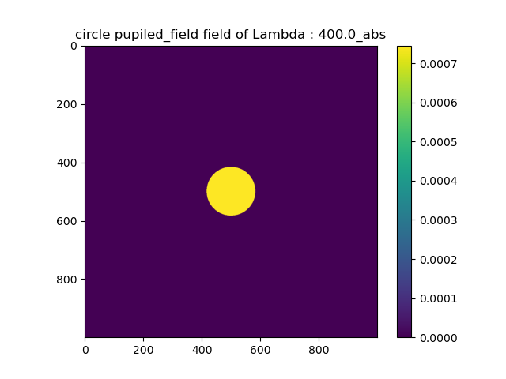

3. Field after applying ASM (distance z = 10µm)  
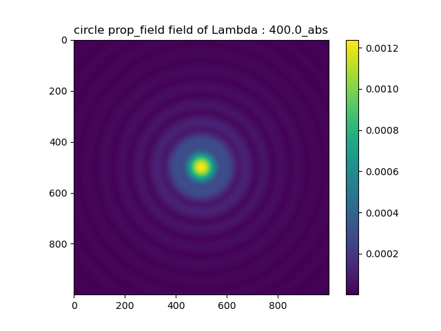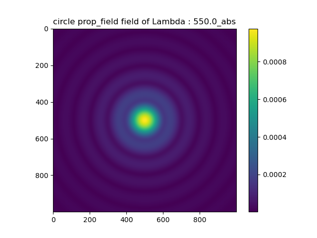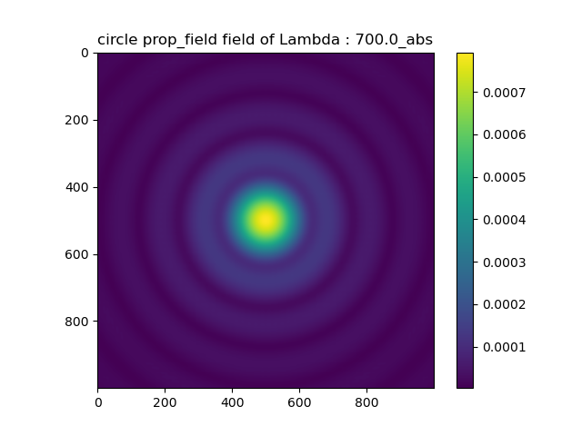


### Square Aperture
1. Field before applying the pupil function of the given aperture. - This is just constant because we set the source as a normal incident plane wave.
2. Field after applying pupil function   
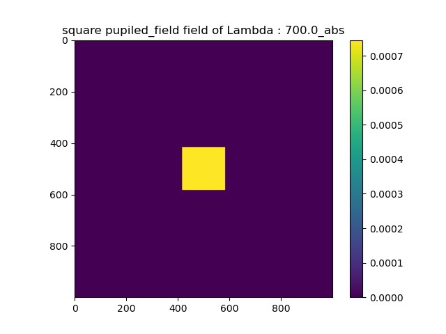

3. Field after applying ASM (distance z = 10µm)  
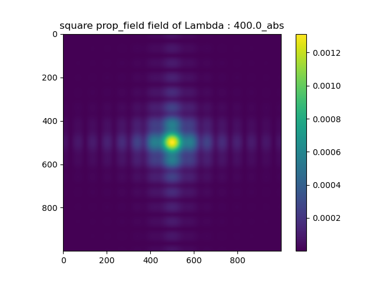


## Check the diffraction pattern for various parameter settings (aperture type, wavelengths, pupil width)

### Circle Aperture
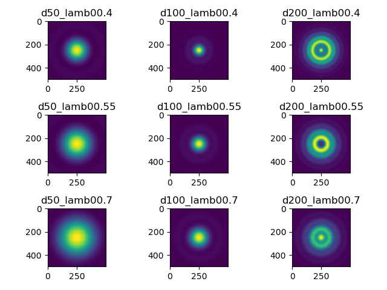  

### Square Aperture
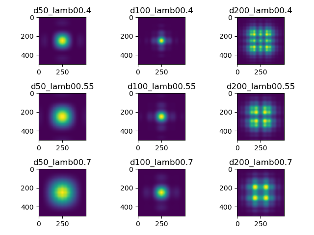  


- As pupil width increases, the main lobe size decreases.
- As wavelength increases, the main lobe size increases.
- **If the pupil width is too large, the diffraction pattern is split.**


### F-number and Diffraction Pattern.
According to $^{[1]}$, as Fresnel number (F-number, $N_F$) increases, the diffraction pattern becomes sharp.  

I visualize this phoenomena.  
1. I set the F-number range as [0.1, 10.] with the 0.1 interval.
2. I visualize the results for both circle and rectangle pupils.

#### F-number and Circle Aperture

The first figure is the intensity.  The second figure is the normalized intensity for the horizontal axis at the center.

Specifically, the f_num[] in the title of each figure denotes the F-number.

1. **Fix the propagation distance and change the pupil's width.**

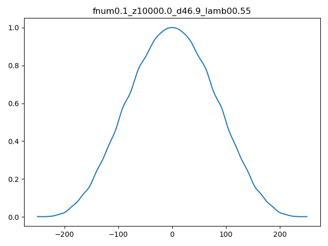

    

2. **Fix the pupil's width and change the propagation distance.**

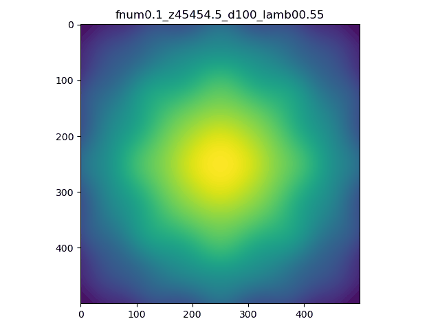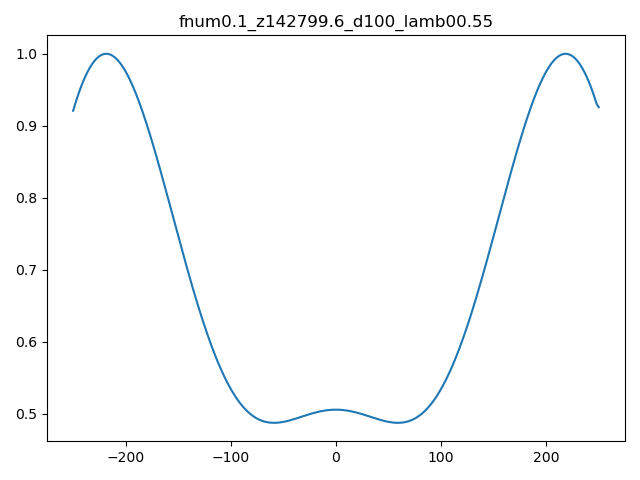

#### F-number and Square Aperture

1. **Fix the propagation distance and change the pupil's width.**

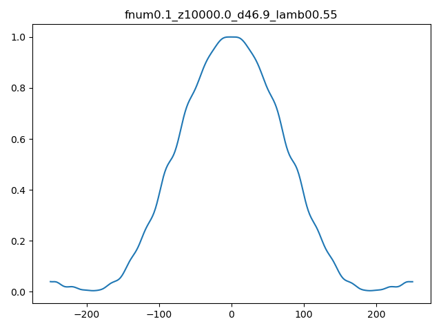


2. **Fix the pupil's width and change the propagation distance.**


- When I change the pupil's width, the diffraction pattern converges. This is because the diameter of the aperture extends the grid.


## Verification by comparing with the analytic solution of the square aperture's diffraction pattern.

There exists the analytic solution of the square aperture's diffraction pattern. $^{[1]}$  
This is expressed with Fresnel integral terms.  
The below is the results of the comparison between my framework's diffraction patterns and the analytic solutions.  

1. **Fix the propagation distance and change the pupil's width.**  

  
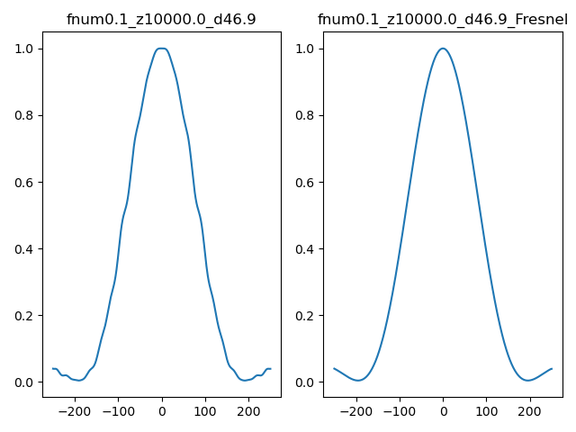
  
2. **Fix the pupil's width and change the propagation distance.**  

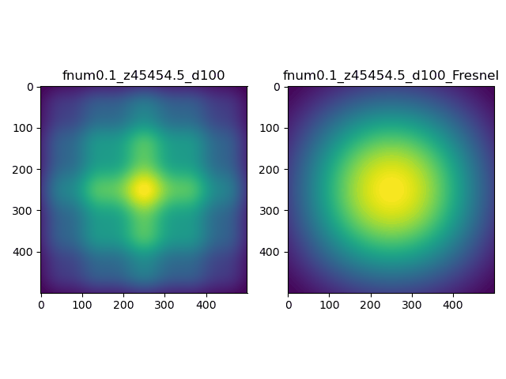  
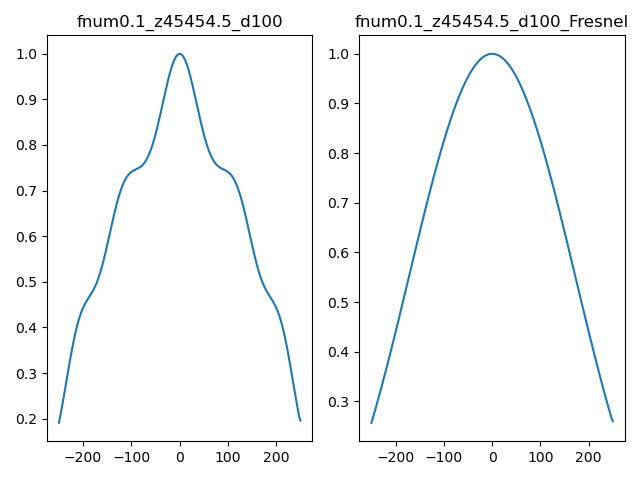

**These results show that WaveOpticsTorch highly aligns with the analytic solution.**

[1] JW Goodman - 2005 - Introduction to Fourier Optics
