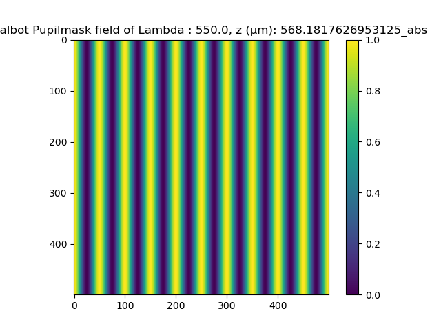
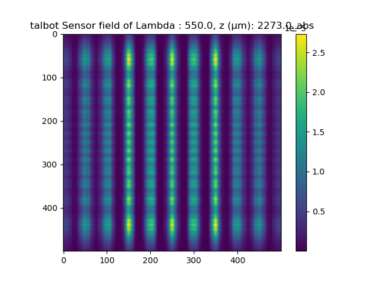
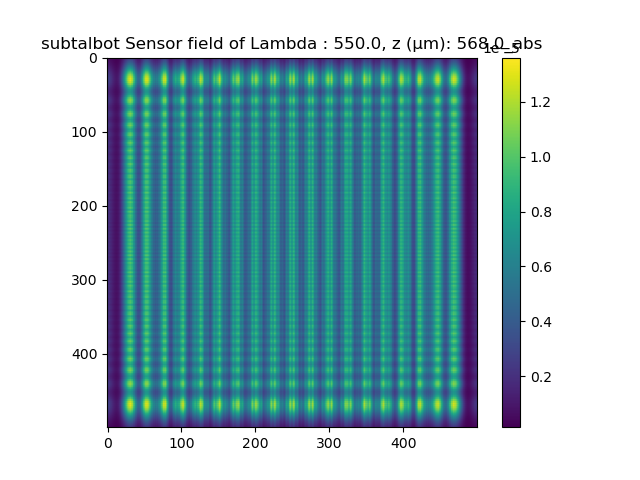

# Sinusoidal Amplitude Image : Talbot Image
The code is at `sin_amp_talbot.py` in this directory.

## Goal
Verify whether the framework can accurately model the talbot images for various propagation distances.  

## Talbot Images?
According to $^{[1]}$, when the below pupil function is given as the sinuoidal amplitude function, then the diffraction pattern becomes different with the various propagation distances.  
$$t_A(x, y) = {1\over 2}[1 + m \cos (2\pi y)/L]$$

The diffraction result of this pupil function is :
$$I(x, y) = {1\over 4}[1 + 2m\cos({\pi \lambda z\over L^2})\cos({2\pi y\over L}) + m^2\cos^2({2\pi y\over L})]$$

1. If ${\pi \lambda z} / L^2 = 2n\pi$, then $I(x,y) = {1\over4}[1 + m\cos (2\pi y/L)]^2$.

    This is the perfect image of the grating "Talbot images"
2. If ${\pi \lambda z} / L^2 = (2n+1)\pi$, then $I(x,y) = {1\over4}[1 - m\cos (2\pi y/L)]^2$.

    This is the contrast reversed version of the above talbot image. This is also a talbot image.
3. If ${\pi \lambda z} / L^2 = (2n+1){\pi\over 2}$, then $I(x,y) = {1\over4}[1 + m^2\cos^2({2\pi y\over L})] = {1\over 4}[(1 + {m^2\over 2} \cos({4\pi y\over L}))]$.

    This has the twice of the talbot image's frequency.  

## Experiments

### Sinusoidal pupil mask  

### Results

1. Talbot image
2. Reversed talbot image
3. Sub-Talbot image

[1] JW Goodman - 2005 - Introduction to Fourier Optics